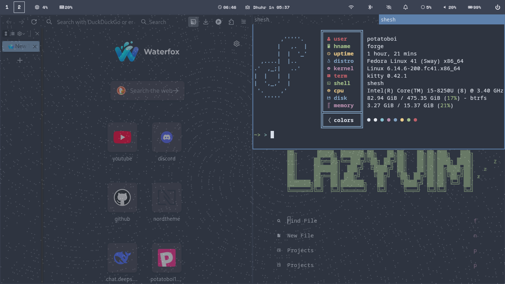

#  dotfile

**Clean • Productive • Nordic**  
*the dotfile that potato use  *


## 🖼️ Visual Gallery

<div align="center">
  
### Work Environment
<a href="screenshots/onwork.png" target="_blank">
  
</a>
<a href="screenshots/onwork1.png" target="_blank">
  
</a>

### Login & Desktop
<a href="screenshots/sddm.png" target="_blank">
  
</a>
<a href="screenshots/main.png" target="_blank">
  
</a>

### Desktop Alternative
<a href="screenshots/main1.png" target="_blank">
  
</a>

</div>


## ✨ Features
- **....**: 
- **optimaized **: 
- **.....**: 
- **....**: 
- **....**: 

## ⚙️ Included Configurations

## 🚀 Installation
```bash
# Clone 
git clone https://github.com/potatoforge120/dotfile.git
