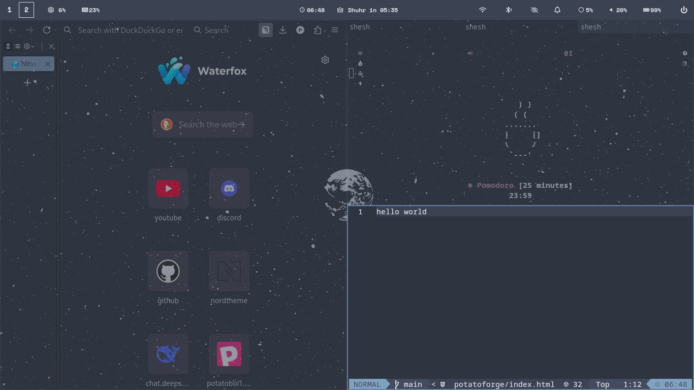
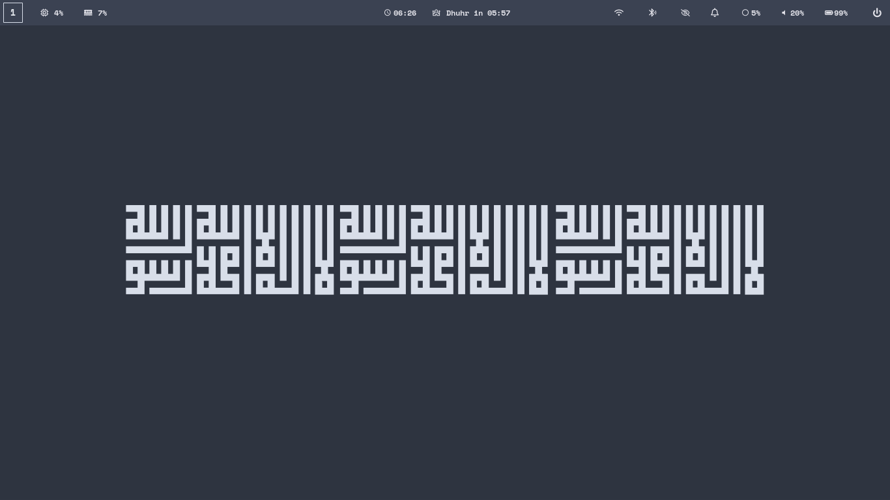

# dotfile
the dotfile that potato use
#  My Dotfiles

**Clean • Productive • Customized**  
*A curated collection of my development environment configurations*

## 🖼️ Visual Showcase

| Work Environment | Login Screen |
|------------------|--------------|
| [](screenshots/onwork.png) | [](screenshots/sddm.png) |
| **Main Desktop** | **Alternative View** |
| [](screenshots/main.png) | [](screenshots/main1.png) |

<div align="center">
  
  <p style="color:#888; font-size:0.9em;">My productive coding environment</p>
</div>


## ✨ Features
- **Terminal Powerhouse**: Zsh with [Starship](https://starship.rs) prompt + [zinit](https://github.com/zdharma-continuum/zinit) plugins
- **Editor Mastery**: Neovim Lua config with LSP, debugging, and 50+ plugins
- **WM Integration**: [i3-gaps](https://github.com/Airblader/i3) / [Hyprland](https://hyprland.org/) configurations
- **Cross-OS**: Works on Linux/macOS with conditional loading
- **One-shot Setup**: Single command installation

## ⚙️ Included Configurations
| Component       | Highlights                              |
|-----------------|-----------------------------------------|
| **Neovim**      | LSP, Treesitter, Telescope, Debug Adapters |
| **Tmux**        | Sessions persistence, TPM plugins, theming |
| **Shell**       | Zsh + Oh-My-Zsh, custom aliases/functions |
| **WM/DE**       | i3/Hyprland keybinds, autostart scripts |
| **Terminal**    | Alacritty/Kitty themes & settings       |
| **Tools**       | Git, GDB, Bat, Fzf, system utilities    |

## 🚀 Installation
```bash
# Clone with submodules
git clone --recursive https://github.com/yourusername/dotfiles.git ~/.dotfiles

# Run installer
cd ~/.dotfiles && ./install
