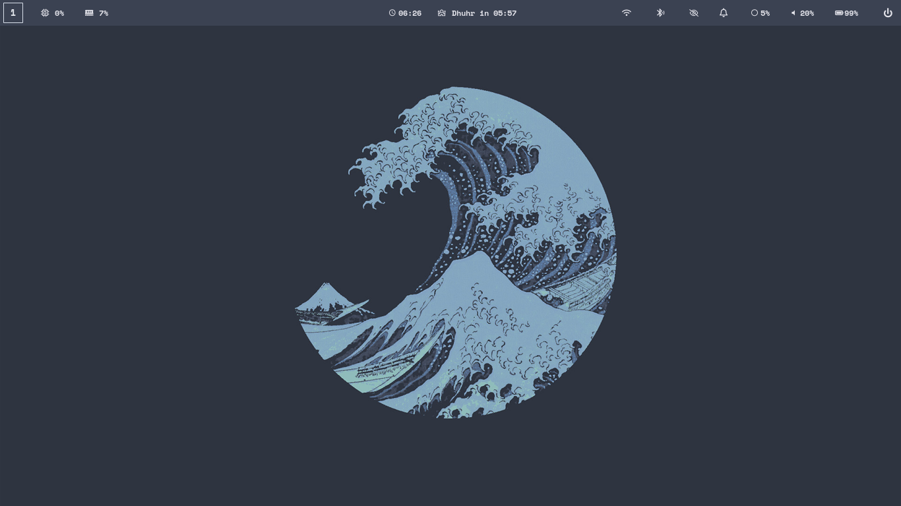

# dotfile
the dotfile that potato use
#  My Dotfiles

**Clean • Productive • Customized**  
*A curated collection of my development environment configurations*

## 🖼️ Visual Showcase
## 🖼️ Visual Gallery

<div align="center">
  
### Work Environment
<a href="screenshots/onwork.png" target="_blank">
  
</a>
<a href="screenshots/onwork1.png" target="_blank">
  
</a>

### Login & Desktop
<a href="screenshots/sddm.png" target="_blank">
  
</a>
<a href="screenshots/main.png" target="_blank">
  
</a>

### Desktop Alternative
<a href="screenshots/main1.png" target="_blank">
  
</a>

</div>


## ✨ Features
- **Terminal Powerhouse**: Zsh with [Starship](https://starship.rs) prompt + [zinit](https://github.com/zdharma-continuum/zinit) plugins
- **Editor Mastery**: Neovim Lua config with LSP, debugging, and 50+ plugins
- **WM Integration**: [i3-gaps](https://github.com/Airblader/i3) / [Hyprland](https://hyprland.org/) configurations
- **Cross-OS**: Works on Linux/macOS with conditional loading
- **One-shot Setup**: Single command installation

## ⚙️ Included Configurations
| Component       | Highlights                              |
|-----------------|-----------------------------------------|
| **Neovim**      | LSP, Treesitter, Telescope, Debug Adapters |
| **Tmux**        | Sessions persistence, TPM plugins, theming |
| **Shell**       | Zsh + Oh-My-Zsh, custom aliases/functions |
| **WM/DE**       | i3/Hyprland keybinds, autostart scripts |
| **Terminal**    | Alacritty/Kitty themes & settings       |
| **Tools**       | Git, GDB, Bat, Fzf, system utilities    |

## 🚀 Installation
```bash
# Clone with submodules
git clone --recursive https://github.com/yourusername/dotfiles.git ~/.dotfiles

# Run installer
cd ~/.dotfiles && ./install
